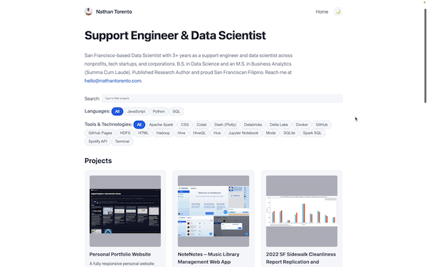

## Personal Portfolio Website
<p align="center">
   
</p> 
This is my personal portfolio website, built to bring together the projects and work I’m most proud of across data science, engineering, analytics, and writing. I designed and built the site using HTML, CSS, and vanilla JavaScript, keeping the focus on clarity, speed, and a clean reading experience. It includes dynamic project rendering, filters for programming languages and tools/technologies, and a light/dark mode that matches your system theme on initial render.
 <br><br> All project information lives in a single modular data file, which makes updating and maintaining the site simple. The interface uses straightforward JavaScript DOM manipulation to load and filter projects, and the layout adapts smoothly to different screen sizes. The site is hosted on GitHub Pages.

## Features
– Dynamic Project Filtering: Browse projects by programming languages and tools/technologies, with optional keyword search.
– Light and Dark Themes: Toggle between themes with persistent preferences stored in localStorage.
– Responsive Layout: CSS Grid and Flexbox ensure readability and usability across screen sizes.
– Modular Data Structure: All project metadata is stored in a centralized JavaScript file for easy maintenance.
– Clean Front-End Architecture: Fully functional site without external frameworks or build tools.

Project Structure
/
├── index.html
├── style.css
├── script.js
├── data/
│   └── projects.js
└── assets/
    └── img/

## Running the Website Locally
To run this site locally:

Clone the repository:
```
git clone https://github.com/nathantorento/personal-website
```

Open the main file in your browser:
```
index.html
```

No dependencies or build steps are required.

## Deployment

This website is deployed using GitHub Pages. After pushing changes to the repository, GitHub Pages automatically updates the live site.
